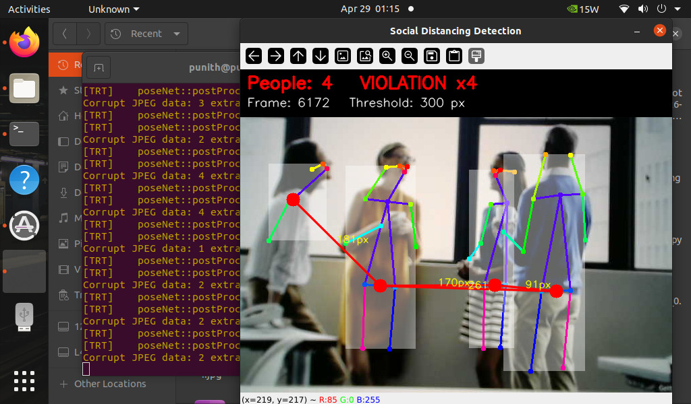
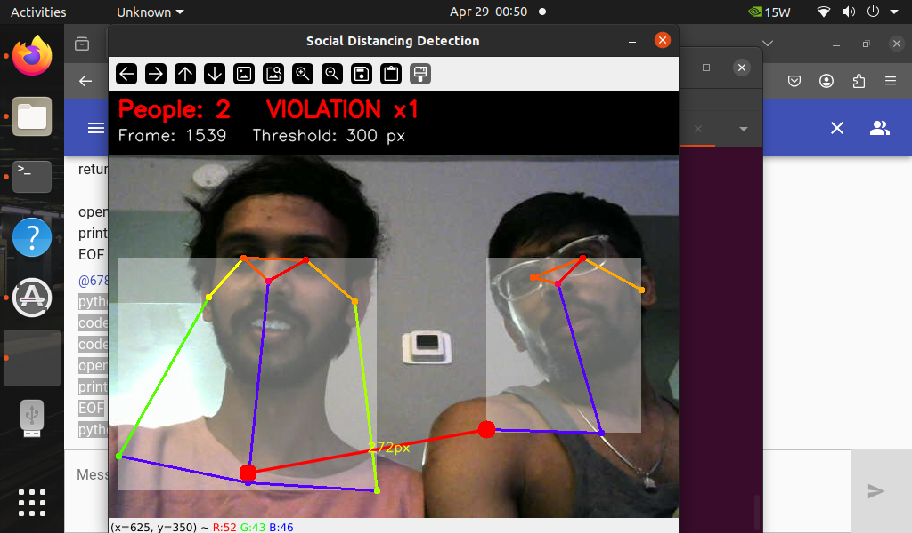
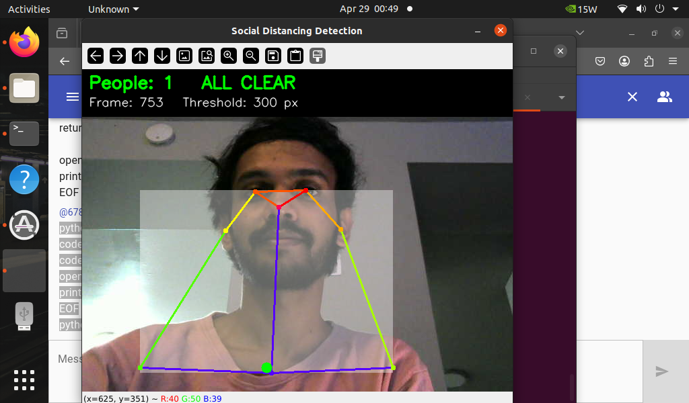

# Social Distancing Detector: A Pose Estimation Project
**Developed by:** Punith Akash Balachandran
**Academic Context:** UMBC Master's in Data Science

## Project Vision
In this lab, I implemented an AI safety assistant designed to monitor human proximity in real-time. [cite_start]Rather than using simple bounding boxes, this project utilizes human pose estimation to identify the precise joint coordinates of each person to calculate physical distance[cite: 3, 8, 21].

## Implementation Logic
The system follows a specific geometric workflow to monitor distancing:

* [cite_start]**Finding Joints:** Using the poseNet model, the AI identifies 18 human joint keypoints[cite: 5, 15, 21].
* [cite_start]**Locating the Hips:** To establish a consistent center for each person, the script calculates the midpoint between the Left Hip (ID 11) and Right Hip (ID 12)[cite: 6, 24].
* [cite_start]**Measuring Distance:** I implemented a Euclidean distance calculation to measure the straight-line pixel distance between these hip centers[cite: 7, 17, 25].
* [cite_start]**The Alert System:** If the calculated distance drops below 300 pixels, the HUD triggers a visual warning[cite: 8, 26].

## Results and Testing
I tested the system under various conditions to ensure the distance logic was accurate.

### Social Distancing Violations
The following cases show the system identifying that people were closer than the 300px threshold:




### Safe Distancing (All Clear)
The system correctly remains in "All Clear" mode when proper distance is maintained:


## Setup and Running
[cite_start]Built for the NVIDIA Jetson platform using the jetson-inference library[cite: 10, 11].

```bash
python3 pose_distance.py /dev/video0
